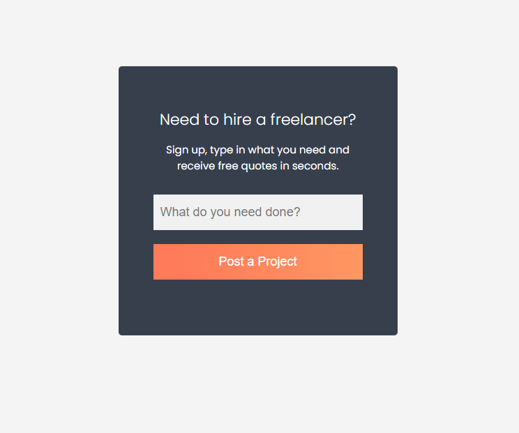

# Freelancer Form Challenge

Now we are going to take a bunch of the stuff we have learned and put it all together to create a small UI project. This is a simple single-input form that you might see on a freelancer's website. Here is the final result:



I want you to look at this image and re-create it the best you can using HTML and CSS.

Your structure and code does NOT have to match mine completely. Just make it look as close as you can to the image above.

If you want to just follow along and not do it yourself, that is fine as well.

Here are some tips:

- Have your container be 500px wide and centered on the page using auto margin.
- I would suggest using a `.card` class for the actual box that holds the form rather than styling the container directly.
- Use a `form` tag to wrap the input and button.
- I used the placeholder attribute for the input field. You can use this or a label if you prefer. Later we will talk about accessibility and why labels are important though.
- For the button, I used a gradient background. You can use a solid color if you prefer. You can use https://cssgradient.io/ to generate a gradient if you want.
- I reversed the gradient on hover.
- I used a `border-radius` of `5px` on the card to give it rounded corners.

<details>
  <summary>Show Solution</summary>

Here is the HTML:

```html
<!DOCTYPE html>
<html lang="en">
  <head>
    <meta charset="UTF-8" />
    <meta name="viewport" content="width=device-width, initial-scale=1.0" />
    <link rel="preconnect" href="https://fonts.googleapis.com" />
    <link rel="preconnect" href="https://fonts.gstatic.com" crossorigin />
    <link
      href="https://fonts.googleapis.com/css2?family=Poppins:wght@300;400;500;600;700;800&display=swap"
      rel="stylesheet"
    />
    <link rel="stylesheet" href="styles.css" />
    <title>HTML & CSS Sandbox</title>
  </head>
  <body>
    <main>
      <div class="container">
        <div class="card">
          <h1>Need to hire a freelancer?</h1>
          <p>
            Sign up, type in what you need and receive free quotes in seconds.
          </p>
          <form action="">
            <div class="form-group">
              <input
                type="text"
                id="text"
                placeholder="What do you need done?"
              />
            </div>
            <div class="form-group">
              <button type="submit">Post a Project</button>
            </div>
          </form>
        </div>
      </div>
    </main>
  </body>
</html>
```

Here is the CSS:

```css
* {
  margin: 0;
  padding: 0;
  box-sizing: border-box;
}

body {
  font-family: 'Poppins', sans-serif;
  background: #f4f4f4;
}

.container {
  width: 400px;
  margin: 100px auto;
}

.card {
  background: #373f4d;
  color: #fff;
  border-radius: 5px;
  text-align: center;
  padding: 60px 50px;
}

.card h1 {
  font-size: 22px;
  margin-bottom: 15px;
  font-weight: 300;
}

.card p {
  font-size: 15px;
  margin-bottom: 30px;
}

.card .form-group {
  margin-bottom: 20px;
}

.card input[type='text'] {
  width: 100%;
  padding: 15px 10px;
  font-size: large;
  border: none;
  background: #f1f1f1;
}

.card button {
  width: 100%;
  padding: 15px 10px;
  font-size: large;
  border: none;
  background: linear-gradient(
    90deg,
    rgba(255, 123, 89, 1) 13%,
    rgba(255, 151, 98, 1) 100%
  );
  color: #fff;
  cursor: pointer;
}

.card button:hover {
  background: linear-gradient(
    90deg,
    rgba(255, 151, 98, 1) 13%,
    rgba(255, 123, 89, 1) 100%
  );
}
```

Like I said, your code does not have to match mine exactly.

</details>
