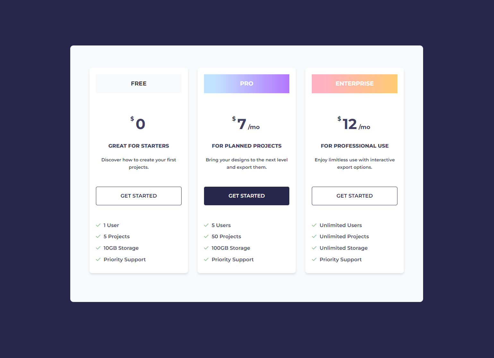

# Pricing Grid Project

In this mini-project, we will create a pricing grid that looks like this:



If you have been following along with the course, we did the HTML part of this already. We are going to add just a little bit to that including the Montserrat font and some Font Awesome checkmark icons. I will include the HTML code below.

We will be using just about everything that we've learned so far in this course. We will use flexbox to align the cards, we will use the box model to add padding and margins, and we will use the background property to add the background colors and gradients.

### HTML

Here is the HTML. I have also included the link to the Google Fonts and Font Awesome in the head of the document.

```html
<!DOCTYPE html>
<html lang="en">
  <head>
    <meta charset="UTF-8" />
    <meta name="viewport" content="width=device-width, initial-scale=1.0" />
    <link rel="preconnect" href="https://fonts.googleapis.com" />
    <link rel="preconnect" href="https://fonts.gstatic.com" crossorigin />
    <link
      href="https://fonts.googleapis.com/css2?family=Montserrat:ital,wght@0,100..900;1,100..900&display=swap"
      rel="stylesheet"
    />
    <link
      rel="stylesheet"
      href="https://cdnjs.cloudflare.com/ajax/libs/font-awesome/6.5.2/css/all.min.css"
      integrity="sha512-SnH5WK+bZxgPHs44uWIX+LLJAJ9/2PkPKZ5QiAj6Ta86w+fsb2TkcmfRyVX3pBnMFcV7oQPJkl9QevSCWr3W6A=="
      crossorigin="anonymous"
      referrerpolicy="no-referrer"
    />
    <link rel="stylesheet" href="styles.css" />
    <title>Pricing</title>
  </head>
  <body>
    <div class="container">
      <div class="pricing">
        <div class="card card-free">
          <h2>Free</h2>
          <p class="price"><sup class="dollar">$</sup>0</p>
          <p class="price-info"><strong>Great For Starters</strong></p>
          <p class="main-text">Discover how to create your first projects.</p>
          <a href="#" class="btn">Get Started</a>
          <ul>
            <li><i class="fas fa-check"></i>1 User</li>
            <li><i class="fas fa-check"></i>5 Projects</li>
            <li><i class="fas fa-check"></i>10GB Storage</li>
            <li><i class="fas fa-check"></i>Priority Support</li>
          </ul>
        </div>
        <div class="card card-pro">
          <h2>Pro</h2>
          <p class="price">
            <sup class="dollar">$</sup>7<span class="month">/mo</span>
          </p>
          <p class="price-info"><strong>For Planned Projects</strong></p>
          <p class="main-text">
            Bring your designs to the next level and export them.
          </p>
          <a href="#" class="btn btn-primary">Get Started</a>
          <ul>
            <li><i class="fas fa-check"></i>5 Users</li>
            <li><i class="fas fa-check"></i>50 Projects</li>
            <li><i class="fas fa-check"></i>100GB Storage</li>
            <li><i class="fas fa-check"></i>Priority Support</li>
          </ul>
        </div>
        <div class="card card-enterprise">
          <h2>Enterprise</h2>
          <p class="price">
            <sup class="dollar">$</sup>12<span class="month">/mo</span>
          </p>
          <p class="price-info"><strong>For Professional Use</strong></p>
          <p class="main-text">
            Enjoy limitless use with interactive export options.
          </p>
          <a href="#" class="btn">Get Started</a>
          <ul>
            <li><i class="fas fa-check"></i>Unlimited Users</li>
            <li><i class="fas fa-check"></i>Unlimited Projects</li>
            <li><i class="fas fa-check"></i>Unlimited Storage</li>
            <li><i class="fas fa-check"></i>Priority Support</li>
          </ul>
        </div>
      </div>
    </div>
  </body>
</html>
```

### Base CSS

Let's add the base CSS to the `styles.css` file.

```css
* {
  margin: 0;
  padding: 0;
  box-sizing: border-box;
}

body {
  font-family: 'Montserrat', sans-serif;
  font-weight: 600;
  line-height: 1.6;
  background-color: #27264b;
  color: #433f63;
}

a {
  text-decoration: none;
  color: #007bff;
}

ul {
  list-style: none;
  padding: 0;
}

li {
  margin-bottom: 10px;
}
```

### Container

Let's add the container styles.

```css
.container {
  max-width: 1100px;
  background: #f8fafe;
  border-radius: 10px;
  margin: 0 auto;
  padding: 70px 60px;
  margin-top: 150px;
}
```

Our container is centered on the page with a max-width of 1100px. It has a background color of `#f8fafe` and a border radius of 10px. We have added some padding to the top and bottom of the container and some margin to the top to push it down from the top of the page.

### Pricing (Flex Container)

The pricing class is a flex container. Let's add the styles for that.

```css
.pricing {
  display: flex;
  justify-content: space-around;
  gap: 30px;
}
```

Now our cards are spaced out evenly with a gap of 30px between them.

### Card

Let's add the styles for the card.

```css
.card {
  background-color: #fff;
  border-radius: 8px;
  padding: 20px;
  flex: 1; /* Make the card take up equal space */
  text-align: center;
  margin-bottom: 20px;
  box-shadow: 0 4px 6px rgba(0, 0, 0, 0.1);
}
```

Our card has a background color of `#fff` and a border radius of 8px. We have added some padding to the card and set the flex property to 1 to make the card take up equal space. We have also added some margin to the bottom of the card and a box shadow to give it a little depth.

### Headings

Let's add the styles for the headings.

```css
.card h2 {
  font-size: 18px;
  text-transform: uppercase;
  margin-bottom: 10px;
  padding: 15px;
  color: #333;
  background: #f8fafe;
  margin-bottom: 60px;
}
```

Our headings have a font size of 18px and are uppercase. We have added some margin to the bottom of the heading and some padding to the top and bottom. We have also added a background color to the heading and some margin to the bottom of the heading.

I want the second and third headings to have a gradient background. Let's add the styles for that.

When I want to experiment with gradients, I like to use [CSS Gradient](https://cssgradient.io). I can create the gradient I want and then copy the CSS code and paste it into my stylesheet.

```css
/* Heading Background Gradients -  https://cssgradient.io */
.card-pro h2 {
  background: linear-gradient(
    90deg,
    rgba(194, 227, 255, 1) 13%,
    rgba(180, 118, 254, 1) 100%
  );
  color: #fff;
}

.card-enterprise h2 {
  color: #fff;
  background: linear-gradient(
    90deg,
    rgba(255, 177, 194, 1) 13%,
    rgba(255, 203, 114, 1) 100%
  );
}
```

I have added the gradient background to the Pro and Enterprise cards. I have also changed the color of the text to white.

### Price Area & Main Text

Let's add the styles for the price area and main text.

```css
.card .price {
  font-size: 45px;
  font-weight: 700;
  margin-bottom: 20px;
}

.card .price .dollar {
  font-size: 18px;
  position: relative;
  left: -5px;
}

.card .price .month {
  font-size: 18px;
  margin-left: 5px;
}

.card .price-info {
  margin-bottom: 20px;
  text-transform: uppercase;
}

.card .main-text {
  font-size: 14px;
  margin-bottom: 50px;
}
```

We positioned the dollar sign to the left of the price and pushed it to the left a little bit. The rest is pretty straightforward.

### Buttons

Let's add the styles for the buttons/links.

```css
.btn {
  display: block;
  background-color: #fff;
  color: #27264b;
  border: 1px solid #27264b;
  text-transform: uppercase;
  padding: 15px;
  border-radius: 5px;
  width: 100%;
  cursor: pointer;
  font-size: 16px;
}

.btn:hover {
  background-color: #27264b;
  color: #fff;
}
```

Our buttons are block-level elements with a background color of `#fff` and a border color of `#27264b`. We have added some padding, border radius, and a width of 100%. We have also added a cursor pointer and a font size of 16px. On hover, the background color changes to `#27264b` and the text color changes to white.

We also added what we call a utility class (btn-primary) to the primary button. A utility class is a class that can be used on multiple elements. In this case, we are using it to change the background color and border color of the button.

```css
.btn-primary {
  background-color: #27264b;
  color: #fff;
}

.btn-primary:hover {
  background-color: #fff;
  color: #27264b;
}
```

### List Items

Let's add the styles for the list items.

```css
.card ul {
  text-align: left;
  margin-top: 50px;
}

.card ul i {
  color: #98ca9e;
  margin-right: 10px;
}
```

Our list items are left-aligned and have a margin at the top. We have added a color to the checkmark icons and some margin to the right.

### Flex Wrap

Right now, if we make the screen smaller, the cards will not wrap. Let's add the `flex-wrap` property to the `.pricing` class.

```css
.pricing {
  display: flex;
  justify-content: space-around;
  gap: 30px;
  flex-wrap: wrap;
}
```

Later, we will add a simple media query to make the cards stack on top of each other when the screen size is smaller. I just don't want to add something that we haven't learned yet.
